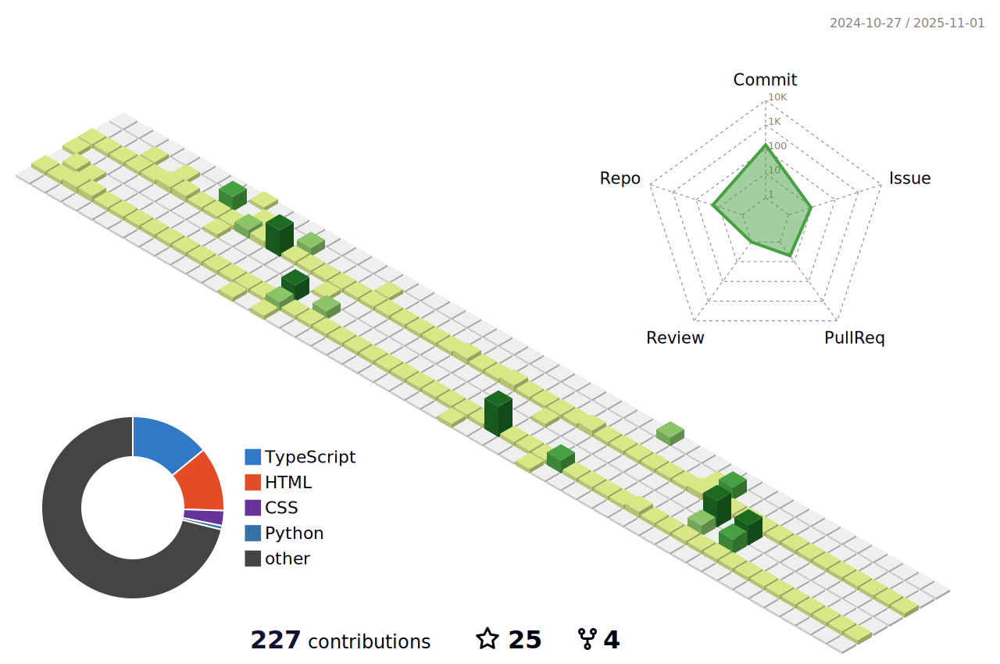

<h1 align="center"> Connect with me: </h1> 

  <h5 align="center"><strong>rcmtcristian@gmail.com<strong></h5>

<h1 align="center">Howdy, I'm Cristian</h1>

  
<h3 align="center">I am a Software Engineer who enjoys venturing into new areas that can test my knowledge and put my expertise to work. Always willing to learn something new that can further assist me in expanding my repertoire of skills.</h3>  
 
  

 
  
  <h2> About Me</h2>

- 🔭 I’m currently working on Many Github Projects

- 🌱 I’m currently learning JS, SASS and NODE 

- 👯 I’m looking to collaborate on Projects, Tech Articles and Meetups  

- 💬 Talk to me about CSS, JavaScript, Freelancing Opportunites, Open Source, Anime 

  
  

  

  <h1 align="center">Technical Skills  </h1>

               
    

  
     
  

    
   
